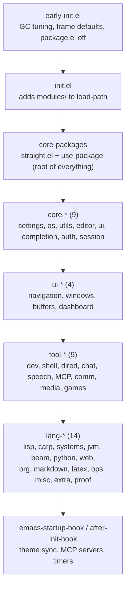
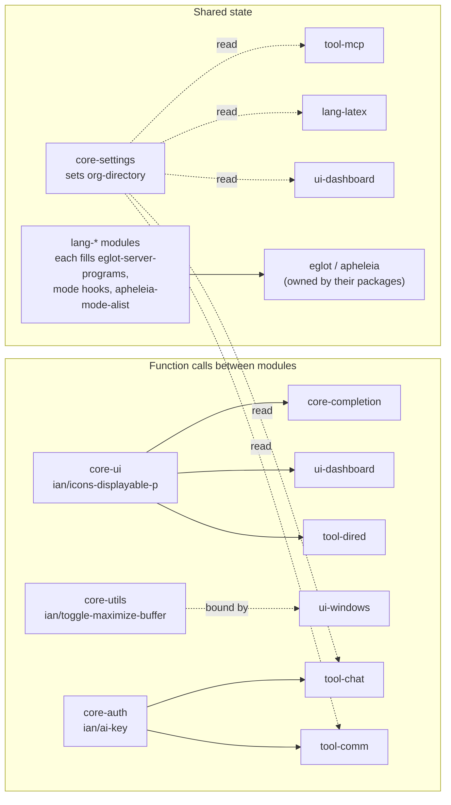
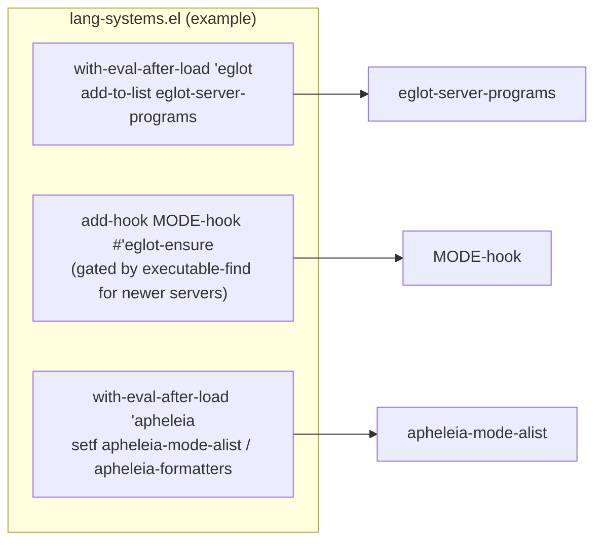

# Architecture

How the configuration starts up and how its modules depend on each other.

## Startup order

`init.el` is the whole hierarchy. No module `require`s another module; a module may rely on anything that loads before it and on nothing that loads after it.



Later groups may use earlier groups. Within a group, order follows `init.el`.

## What modules share

Direct function calls connect a few modules; other coordination uses variables and hooks that Emacs or a package owns.



- `core-settings` establishes `org-directory` before UI, tool, and language modules load. `core-settings` also owns the named Org files (`ian/org-files`, reached via `(ian/org-file 'inbox)`) and `ian/org-existing-paths`. Consumers derive named files through `ian/org-file` and directories from the shared root; `lang-org` configures Org behavior without resetting the root or spelling file names.
- Timing hooks live in `core-ui` (theme sync on `after-init-hook` plus a timer) and `tool-mcp` (MCP servers on `emacs-startup-hook`).

## MCP servers

`tool-mcp` owns one data table, `ian/mcp-servers`, describing the local MCP
servers (filesystem, duckduckgo, fetch, mcp-shell-server, plus a Clojure
server registered lazily per CIDER connection). Converters translate it into
each consumer's format: `ian/mcp-hub-server-defs` feeds `mcp-hub-servers`
(used by org-mcp and by gptel as tools via `gptel-mcp-connect`), and
`ian/mcp-agent-shell-server-defs` feeds `agent-shell-mcp-servers` (set when
agent-shell loads). Servers are only started on demand — `gptel-mcp-connect`
or `mcp-hub-start-all-server` interactively, or when an agent-shell session
is created. Adding or changing a server means editing the table only.

## Language toolchains

A language is registered entirely inside the `lang-*` module that owns it, using plain Emacs forms. There is no registration function.



Each toolchain lists its `-mode` and `-ts-mode` twins explicitly. See `test/lang-lsp-test.el` for the invariants that are checked.

| Module | Registers |
|---|---|
| `lang-lisp` | Clojure (project-root guard), Racket |
| `lang-systems` | C, C++, Rust, Go, Zig |
| `lang-jvm` | Kotlin, Scala (Java goes through `eglot-java`) |
| `lang-beam` | Elixir, Erlang, Gleam |
| `lang-python`, `lang-web` | Python; JavaScript, TypeScript (Eglot's built-in servers) |
| `lang-ops` | Terraform, Dockerfile, Nix |
| `lang-misc` | Haskell, Bash, Ruby, Lua |
| `lang-extra` | Dart, R, Julia |
| `lang-proof` | Idris 2 (Lean uses `lsp-mode` on purpose) |

## Autostart rule

- Languages that autostarted before this layout (Python, JS/TS, Rust, Go, C/C++, Java, Elixir, Haskell, Terraform, shell, Dockerfile, Nix, Clojure, Dart, Idris) hook `eglot-ensure` unconditionally.
- Newer ones (Kotlin, Scala, Ruby, Lua, Zig, Racket, Gleam, Erlang, R, Julia) hook only if the server binary is on `PATH` when the module loads. Installing one mid-session needs a restart, and a server that only exists inside a project's `envrc` environment is missed.

## Request-time credentials and packaged workers

`core-auth` owns shared lookup and fallback rules. Provider facts live in one
table, `ian/ai-providers`, keyed by provider symbol (`openai`, `anthropic`,
`google`); each row is a plist with `:host`, optional `:aliases` and `:env`.
`(ian/ai-key PROVIDER &optional NOERROR)` resolves a key from auth-source
(host, then aliases, user `apikey`) and then the env var; an unknown provider
symbol always signals. `tool-chat` registers all gptel backends even when
credentials are absent, passing `(ian/ai-key-callback PROVIDER)` closures to
gptel, chatgpt-shell, DALL-E shell and Minuet. These resolve credentials when
used; auth-source retains its own caching behavior. Gptel still defaults to
NeoTek. `ian/ollama-host` (memoized) and `ian/ollama-host-and-port` also live
in core-auth.

Minuet reevaluates its provider preference before each completion using named
inline advice on its two completion commands; the preference order lives in
`ian/ai-completion-order` (Minuet provider to provider symbol) and is resolved
by `ian/ai-available-provider`. Org AI lacks a credential callback setting, so
the named advice `ian/org-ai--get-token-with-shared-credentials` uses
`org-ai-service` directly as a provider symbol (org-ai's `openai`, `anthropic`
and `google` match the table) and adapts its token lookup, while retaining
explicit tokens and native lookup for other services. The org-ai and Minuet
advice targets are upstream entry points and must be checked when upgrading
packages.

WhatsAppel's straight recipe includes its four Python workers and their shared
`bridge_protocol.py`, preserving the `scripts/` directory relative to its Lisp
files. Installing only Lisp can pass a load check but fail on first use.

Offline checks (after package installation):

```sh
emacs --batch -Q -l init.el -l test/chat-credentials-test.el -f ert-run-tests-batch-and-exit
python3 test/whatsapp-runtime-test.py
```

The credential test uses synthetic values and stops Minuet before any request;
the worker check imports copies isolated from the upstream checkout. Neither
check connects to an account or sends a message.

## Clipboard

`core-os.el` (section 5) owns one clipboard module. Its interface is
`ian/clipboard-copy` and `ian/clipboard-paste`, installed once and
unconditionally as `interprogram-cut-function` / `interprogram-paste-function`.
`ian/clipboard-adapter` picks the adapter at call time, per frame, in priority
order: `wsl` (clip.exe / powershell, WSL result cached) > `gui`
(`gui-select-text` / `gui-selection-value`) > `wayland` (`WAYLAND_DISPLAY` +
wl-copy) > `x11` (`DISPLAY` + xclip) > nil (copy is a no-op, paste returns nil).
The yank advice just calls `ian/clipboard-copy`.
