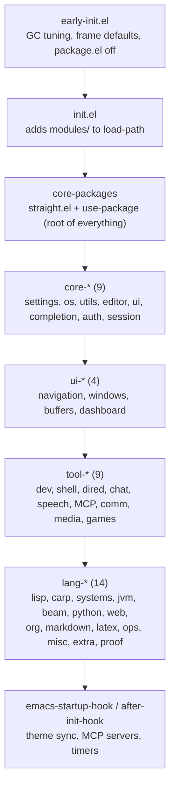
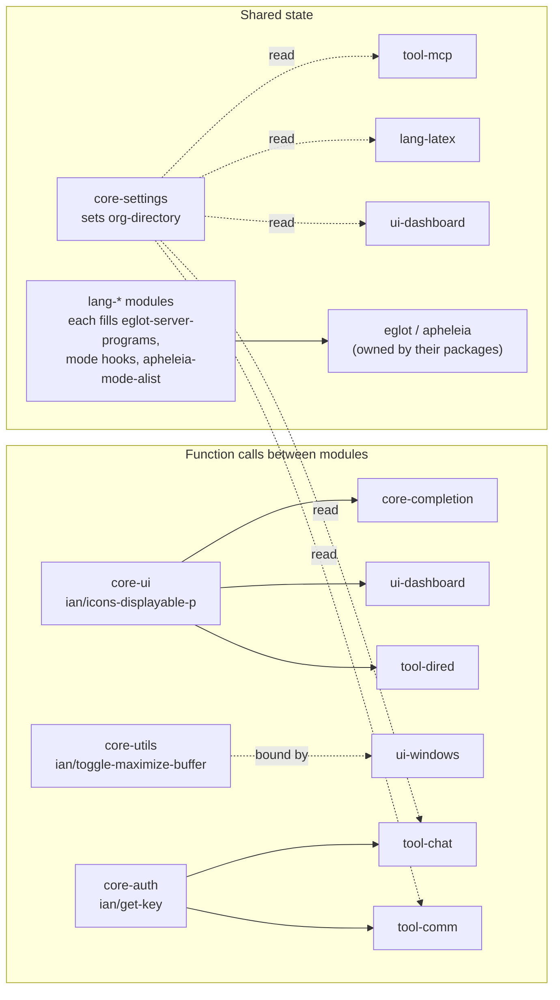
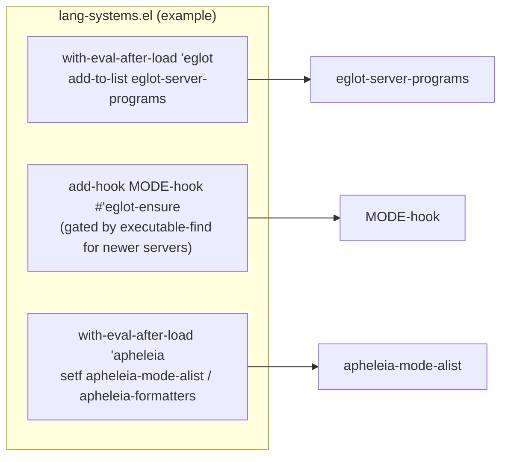

# Architecture

How the configuration starts up and how its modules depend on each other.

## Startup order

`init.el` is the whole hierarchy. No module `require`s another module; a module may rely on anything that loads before it and on nothing that loads after it.

Later groups may use earlier groups. Within a group, order follows `init.el`.

## What modules share

Direct function calls connect a few modules; other coordination uses variables and hooks that Emacs or a package owns.

- `core-settings` establishes `org-directory` before UI, tool, and language modules load. Consumers derive their paths from this shared root; `lang-org` configures Org behavior and derived Org paths without resetting the root.
- Timing hooks live in `core-ui` (theme sync on `after-init-hook` plus a timer) and `tool-mcp` (MCP servers on `emacs-startup-hook`).

## Language toolchains

A language is registered entirely inside the `lang-*` module that owns it, using plain Emacs forms. There is no registration function.

Each toolchain lists its `-mode` and `-ts-mode` twins explicitly. See `test/lang-lsp-test.el` for the invariants that are checked.

| Module | Registers |
|---|---|
| `lang-lisp` | Clojure (project-root guard), Racket |
| `lang-systems` | C, C++, Rust, Go, Zig |
| `lang-jvm` | Kotlin, Scala (Java goes through `eglot-java`) |
| `lang-beam` | Elixir, Erlang, Gleam |
| `lang-python`, `lang-web` | Python; JavaScript, TypeScript (Eglot's built-in servers) |
| `lang-ops` | Terraform, Dockerfile, Nix |
| `lang-misc` | Haskell, Bash, Ruby, Lua |
| `lang-extra` | Dart, R, Julia |
| `lang-proof` | Idris 2 (Lean uses `lsp-mode` on purpose) |

## Autostart rule

- Languages that autostarted before this layout (Python, JS/TS, Rust, Go, C/C++, Java, Elixir, Haskell, Terraform, shell, Dockerfile, Nix, Clojure, Dart, Idris) hook `eglot-ensure` unconditionally.
- Newer ones (Kotlin, Scala, Ruby, Lua, Zig, Racket, Gleam, Erlang, R, Julia) hook only if the server binary is on `PATH` when the module loads. Installing one mid-session needs a restart, and a server that only exists inside a project's `envrc` environment is missed.
